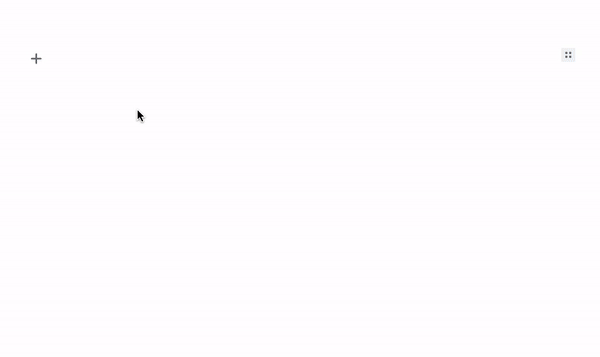

# Youtube Embed Tool
An [Editor.js](https://editorjs.io) plugin to embed YouTube Video.

Simply copy and paste YouTube video URL to embed.




## Installation
### Install via NPM

Get the package

```shell
npm i editorjs-youtube-embed
```

Include module at your application

```javascript
const YoutubeEmbed = require('editorjs-youtube-embed');
```

### Download to your project's source dir
1. Download folder `dist` from repository
2. Add `dist/main.js` file to your page.

## Usage

Add a new Tool to the `tools` property of the Editor.js initial config.

```javascript
var editor = EditorJS({
  ...
  
  tools: {
    ...
    youtubeEmbed: YoutubeEmbed,
  }
  
  ...
});
```

## Config Params
This tool has no config params

## Output data

| Field          | Type      | Description                     |
| -------------- | --------- | ------------------------------- |
| url            | `string`  | video url                       |


```json
{
    "type": "youtubeEmbed",
    "data": {
        "url": "https://www.youtube.com/watch?v=L229QDxDakU"
    }
}
```